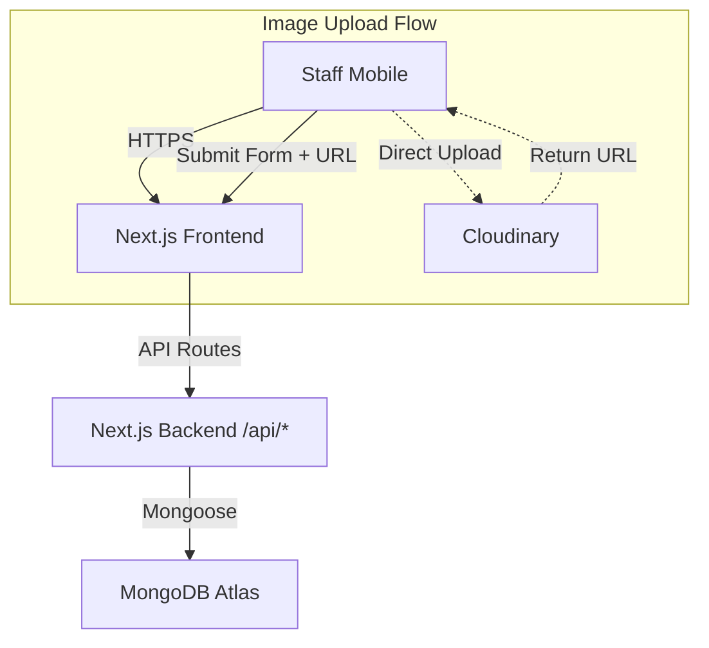

# Basic Design Document (BDD)

**Project:** Hàng Nhật Nội Địa - Inventory Manager
**Architecture:** Serverless MERN (Next.js + MongoDB)
**UI Library:** `shadcn/ui` + Tailwind CSS

## 1. System Architecture

The application follows a standard **Next.js App Router** serverless pattern.



## 2. Directory Structure (App Router)

This structure tells the developer exactly where to put files.

```text
/app
  /api
    /products
      route.ts       # GET (List), POST (Create)
      /[id]
        route.ts     # PUT (Update), DELETE (Delete), GET (Detail)
  /products
    /new
      page.tsx       # "Add Product" Form
    /[id]
      page.tsx       # "Edit Product" Form
  page.tsx           # Dashboard / Product List
  layout.tsx         # Main Layout (Navbar, Toast Provider)
  globals.css        # Tailwind directives

/components
  /ui                # shadcn/ui components (Button, Input, Card, etc.)
  /forms
    ProductForm.tsx  # Reusable form for Create & Edit
  /products
    ProductCard.tsx  # Display component for the list
  Navbar.tsx         # Simple header with "Add" button

/lib
  db.ts              # Singleton MongoDB connection helper
  cloudinary.ts      # Cloudinary configuration (if needed server-side)
  utils.ts           # Helper functions (currency formatter)

/models
  Product.ts         # Mongoose Schema

```

## 3. Data Design (Schema & Validation)

We will use **Zod** for frontend validation and **Mongoose** for backend enforcement.

### 3.1 Zod Schema (Frontend Validation)

Use this schema in `ProductForm.tsx` with `react-hook-form`.

```typescript
const formSchema = z.object({
  title: z.string().min(2, "Title is required"),
  price: z.object({
    selling: z.coerce.number().min(1000, "Price must be at least 1,000 VND"),
    original: z.coerce.number().optional(),
  }),
  stock: z.coerce.number().default(1),
  category: z.string().default("General"),
  // Note: Images are handled separately as an array of strings
});

```

## 4. API Specification

All endpoints return JSON. Standard HTTP status codes apply (200 OK, 201 Created, 400 Bad Request, 500 Server Error).

### 4.1 Endpoints

* **`GET /api/products`**
* **Query Params:** `?page=1&limit=20`, `?search=glucosamine`
* **Response:** `{ data: Product[], meta: { total, page } }`


* **`POST /api/products`**
* **Body:** `{ title, price: { selling }, images: [url], ... }`
* **Logic:** Connect DB -> Validate Body -> `Product.create()` -> Return new Doc.


* **`PUT /api/products/[id]`**
* **Body:** Partial object (e.g., `{ stock: 5 }`).
* **Logic:** `Product.findByIdAndUpdate(id, body, { new: true })`.


* **`DELETE /api/products/[id]`**
* **Logic:** `Product.findByIdAndDelete(id)`.


## 5. Component Design (Mobile-First)

### 5.1 The "Product List" (Dashboard)

* **Component:** `app/page.tsx`
* **Layout:** A Grid (1 column on mobile, 3 on desktop).
* **Item:** `ProductCard.tsx`
* **Visual:**
* Left: Thumbnail Image (Aspect Ratio Square).
* Middle: Title (truncated 2 lines), Price (Bold, Red).
* Right: Badge (Stock status).


* **Interaction:** Tapping the card navigates to `/products/[id]` (Edit mode).


### 5.2 The "Product Form" (Create/Edit)

* **Component:** `components/forms/ProductForm.tsx`
* **Libraries:** `react-hook-form`, `zod`, `lucide-react`.
* **Image Upload UX:**
1. User taps a big dashed box "Add Image".
2. Browser opens file picker (Camera/Gallery).
3. **Code Logic:** On file select, JavaScript immediately `fetch` POST to Cloudinary API (Unsigned Preset).
4. **Loading State:** Show a spinner *inside* the image box.
5. **Success:** Replace spinner with the image preview. Store the returned URL in a hidden form field or React state.


## 6. Security & Configuration

* **Environment Variables (`.env.local`):**
```bash
MONGODB_URI=mongodb+srv://...
NEXT_PUBLIC_CLOUDINARY_CLOUD_NAME=...
NEXT_PUBLIC_CLOUDINARY_UPLOAD_PRESET=... # Unsigned preset for client-side upload

```


* **Protection:** For V1, use **Basic Auth Middleware**.
* Create `middleware.ts`.
* Check for a cookie or basic header. If missing, redirect to a simple `/login` page with a hardcoded password check.


## 7. Implementation Steps for Developer

1. **Setup:** `npx create-next-app@latest` with Tailwind & TypeScript.
2. **UI:** Run `npx shadcn-ui@latest init` and add `card`, `input`, `button`, `form`.
3. **DB:** Create `lib/db.ts` to cache the Mongoose connection (crucial for Next.js hot-reloading).
4. **Cloudinary:** Enable "Unsigned Uploads" in Cloudinary Settings and get the Preset Name.
5. **Coding:**
* Build `ProductForm` first (hardest part).
* Build API routes to accept the form data.
* Build the Dashboard list to fetch and display.

